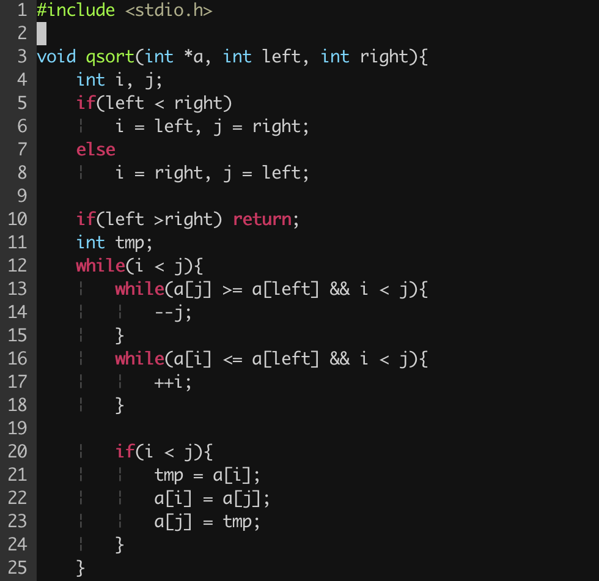

indent-bar
==========

This plugin displays thin vertical lines at each indentation level for code indented with spaces.

## Requirements
This plugin works only on Vim 7.3+ as it uses the newly added feature `conceal` in Vim 7.3.

## Installation
There are three ways to install indent-bar:

- 1) built-in auto-load directory
- 1) built-in package management (Vim 8.0+, see `:h package`)
- 2) third party plugin manager

##### 1) auto-load directory
We can simply put `indent-bar/*` in Vim auto-load directory:

- `~/.vim` (Linux)
- `~/vimfiles` (Windows)

##### 2) built-in package management

Vim 8.0 adds a long missing feature: built-in package management, we can do as below to install indent-bar:

```bash
git clone https://github.com/juniway/indent-bar.git ~/.vim/pack/vendor/start/indent-bar
vim -u NONE -c "helptags  ~/.vim/pack/vendor/start/indent-bar/doc" -c "q"
```

##### 3) third party package manager
There are multiple options when you decide to use third party package manager, please follow the  guidelines respectively.

- for **Pathogen**, please place indent-bar in `~/.vim/bundle`
- for **Vundle**, add `Plugin 'juniway/indent-bar'` to your `~/.vimrc`
- for **Plug**, add `Plug 'juniway/indent-bar` to your `~/.vimrc`

## Customization
To apply customization, apply the variable definitions to your `.vimrc` file.

**Change Character Color**

indent-bar will overwrite 'conceal' color with grey by default. If you want to highlight conceal color with your colorscheme, disable by:

```vim
let g:indent_bar_set_colors = 0
```

Or you can customize conceal color by:
```vim
" Vim
let g:indent_bar_color_term = 239

" GVim
let g:indent_bar_color_gui = '#A4E57E'

" none X terminal
let g:indent_bar_color_tty_light = 7 " (default: 4)
let g:indent_bar_color_dark = 1 " (default: 2)

" Background (Vim, GVim)
let g:indent_bar_bgcolor_term = 202
let g:indent_bar_bgcolor_gui = '#FF5F00'
```

**Change Indent Char**

Vim and GVim
```vim
let g:indent_bar_char = 'c'
```
where `'c'` can be any ASCII character. You can also use one of `¦`, `┆`, `│`, `⎸`, or `▏` to display more beautiful lines. However, these characters will only work with files whose encoding is UTF-8.

or
```vim
let g:indent_bar_char_list = ['|', '¦', '┆', '┊']
```
each indent level has a distinct character.

**Change Conceal Behaviour**

This plugin enables the Vim `conceal` feature which automatically hides stretches of text based on syntax highlighting. This setting will apply to all syntax items.

For example, users utilizing the built in json.vim syntax file will no longer see quotation marks in their JSON files.

indent-bar will overwrite your "concealcursor" and "conceallevel" with default value:

```vim
let g:indent_bar_concealcursor = 'inc'
let g:indent_bar_conceallevel = 2
```

You can customize these settings, but the plugin will not function if `conceallevel` is not set to 1 or 2.

If you want to keep your conceal setting, put this line to your vim dotfile:
```vim
let g:indent_bar_set_conceal = 0
```

See the [VIM Reference Manual](http://vimdoc.sourceforge.net/htmldoc/version7.html#new-conceal) for more information on the `conceal` feature.


**Disable by default**
```vim
let g:indent_bar_enabled = 0
```

### Commands
`:IndentBarToggle` toggles lines on and off.

### Font patching
If you find all the standard unicode and ASCII characters too obtrusive, you might consider patching your font with the [indent-bar-dotted-guide.eps][glyph] glyph provided.  [FontForge][fontforge] makes the process amazingly simple:

 1. Download and install FontForge.
 2. Locate and open your terminal/gVim font.
 3. Open the font in FontForge, choose __Goto__ from the __View__ menu and select _Private Use Area_ from the drop down box.
 4. In the private use area, locate a blank spot for the glyph. Make a note of the code, e.g. `U+E0A3`.
 5. Double-click the selected code point to open the font drawing tool.
 6. From the __File__ menu, select __Import...__ and locate the _indent-bar-dotted-guide.eps_ file.
 7. Once imported, choose __File__ -> __Generate Fonts__ and choose a location and file type for the new font.

Once completed, your new font will contain the more subtle dotted guide and all you have to do is set that glyph to `g:indent_bar_char` in your `.vimrc` file.

[glyph]: glyph/indent-bar-dotted-guide.eps
[fontforge]: http://fontforge.github.io/

## Screenshots


## License
- MIT
